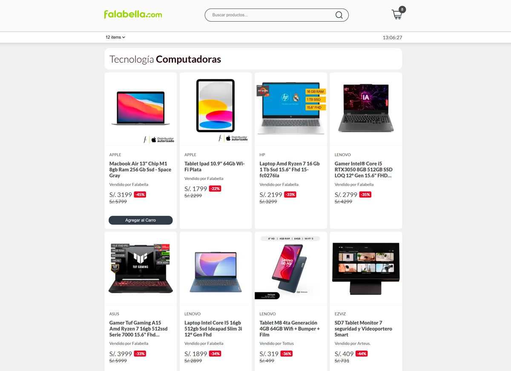
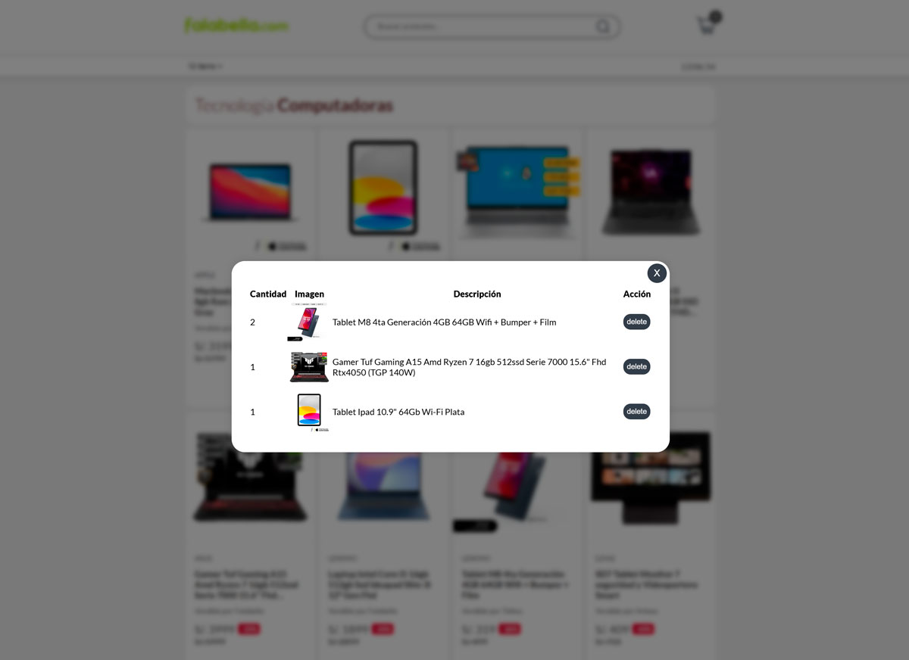

# cibertec2-dew-t2

Este proyecto es una implementación básica de un **carrito de compras** desarrollado con **React**, usando tecnologías como **TypeScript** y **Zustand**, como parte del curso de Desarrollo de Entornos Web.





## 📦 Requisitos previos

Asegúrate de tener instalado:

- [Node.js](https://nodejs.org/) (versión 16 o superior)
- [pnpm](https://pnpm.io/es/installation) (gestor de paquetes)

> 💡 Si no tienes `pnpm`, puedes usar npm

---

## 🔧 Pasos para ejecutar el proyecto

### 1. Clonar el repositorio

```bash
git clone https://github.com/luisangelsalcedo/cibertec2-dew-t2.git

```

### 2. Entrar al directorio del proyecto

```
cd cibertec2-dew-t2
```

### 3. Instalar las dependencias con pnpm

```
pnpm install

```

### 4. Iniciar el servidor de desarrollo

```
pnpm dev
```

## 🌐 Tecnologías utilizadas

- React + Vite
- TypeScript
- Zustand
- SCSS
- React Context
- pnpm
